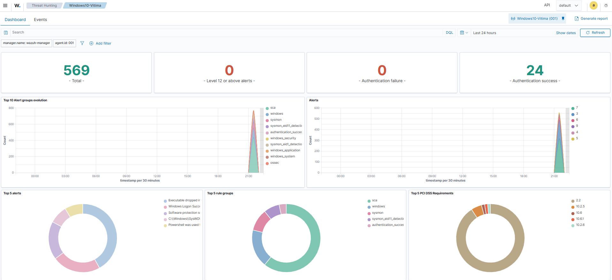
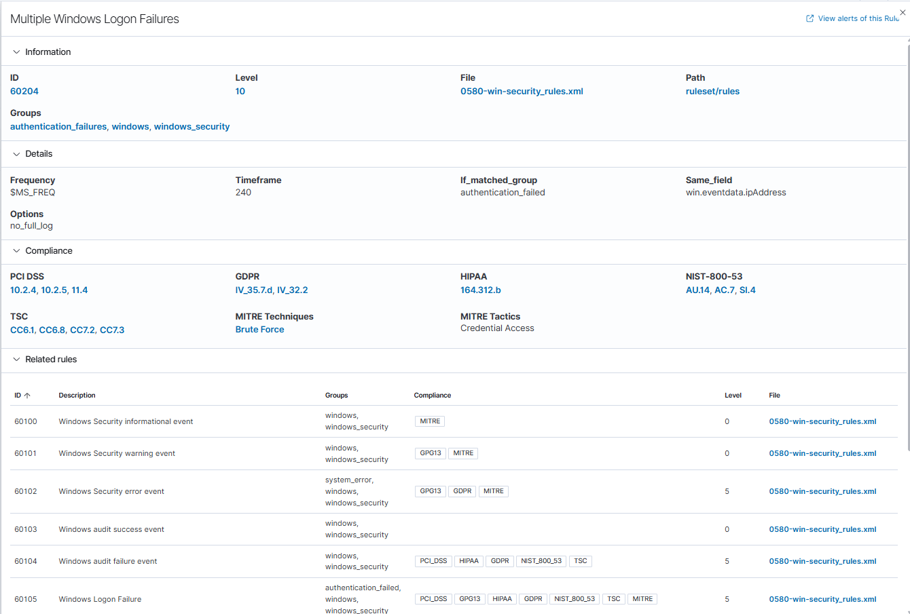
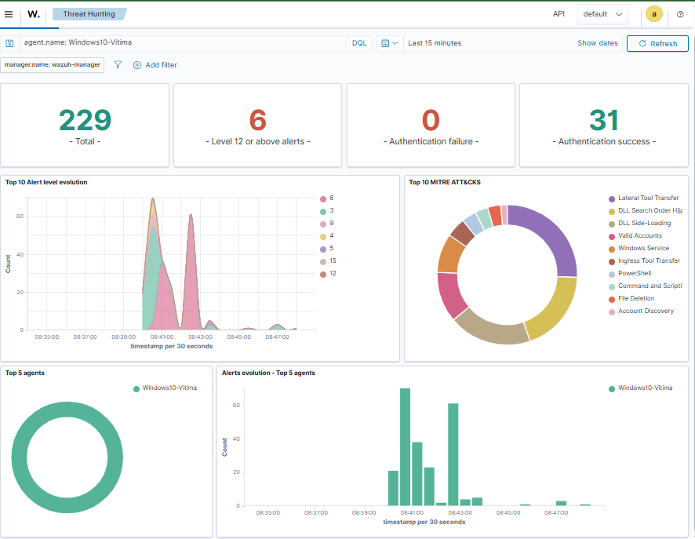

# Mini SOC Lab — Detecção de Ataques com Wazuh SIEM

**Autor:** Pedro
**Data:** Julho de 2026
**Repositório:** Metazoa Store (portfólio pessoal) | Projeto de Cibersegurança #1

---

## 📋 Resumo Executivo

Este projeto documenta a construção de um **laboratório de SOC (Security Operations Center) em miniatura**, com o objetivo de simular ataques reais contra um endpoint Windows e validar a capacidade de detecção de um SIEM open-source (Wazuh), mapeando cada técnica ao framework **MITRE ATT&CK**.

O laboratório cobre o ciclo completo de uma operação de Blue Team: **coleta de telemetria → correlação de eventos → geração de alertas → investigação → triagem (incluindo descarte de falso positivo)**.

---

## 🎯 Objetivo

Construir, do zero, um ambiente de detecção funcional capaz de identificar três classes de ataque comuns em intrusões reais:

1. **Acesso inicial via força bruta** (credential access)
2. **Execução ofuscada via PowerShell** (execution / defense evasion)
3. **Escalação de privilégio local** (privilege escalation)

---

## 🏗️ Arquitetura do Ambiente

```
┌─────────────────────────┐          ┌──────────────────────────┐
│   Kali Linux (Atacante)  │          │  Windows 10 (Vítima)      │
│   192.168.56.x           │─────────▶│  192.168.56.101           │
│   crackmapexec / hydra   │  ataques │  Sysmon + Wazuh Agent     │
└─────────────────────────┘          └─────────────┬────────────┘
                                                      │ eventos (porta 1514)
                                                      ▼
                                      ┌──────────────────────────┐
                                      │  Wazuh Manager (Ubuntu)   │
                                      │  192.168.56.10             │
                                      │  Wazuh Indexer + Dashboard │
                                      │  Filebeat                  │
                                      └──────────────────────────┘
```

Todas as VMs rodam em **VirtualBox**, interligadas por uma rede **Host-only** (`192.168.56.0/24`), isolada da internet exceto para downloads pontuais de ferramentas.

---

## 🧰 Stack Tecnológico

| Componente | Função |
|---|---|
| **Ubuntu Server 26.04 LTS** | Sistema operacional hospedeiro do Wazuh Manager, Indexer e Dashboard |
| **Wazuh 4.14.5** (Manager, Indexer, Dashboard) | SIEM — coleta, correlação, alertas e visualização |
| **Sysmon** (config SwiftOnSecurity) | Telemetria detalhada de processos, DLLs e arquivos no Windows |
| **Filebeat** | Envio dos alertas do Manager para o Indexer |
| **Windows 10 Home** | Endpoint "vítima" monitorado |
| **Kali Linux** | Máquina do "atacante" |
| **crackmapexec / Hydra** | Ferramentas de simulação de ataque |

A instalação foi feita **manualmente via `apt`** (não pelo instalador assistido), o que trouxe desafios reais de integração — como configuração de certificados TLS, ajuste do Filebeat e persistência de rede — replicando problemas comuns em ambientes de produção.


*Dashboard geral do agente Windows10-Vitima: 569 eventos coletados em 24h, com breakdown por grupo de regras (sysmon, windows_security, sca) e mapeamento automático de compliance PCI DSS.*

---

## 🔴 Cenário 1 — Força Bruta via SMB

**Técnica MITRE ATT&CK:** T1110 (Brute Force)

### Execução do ataque
Foi criado um usuário de teste (`funcionario`) com senha fraca (`senha123`) no Windows-Vítima. A partir do Kali, o `crackmapexec` testou uma wordlist de 10 senhas contra o serviço SMB (porta 445):

```bash
crackmapexec smb 192.168.56.101 -u funcionario -p senhas.txt
```

**Resultado:** 8 tentativas falhas (`STATUS_LOGON_FAILURE`) seguidas de 1 sucesso — a assinatura clássica de um ataque de força bruta bem-sucedido.

### Detecção
O Wazuh capturou o padrão automaticamente, sem necessidade de regras customizadas:

- **9 eventos de falha de autenticação + 5 de sucesso** correlacionados no mesmo intervalo de tempo
- **Mapeamento MITRE ATT&CK automático:** Brute Force, Valid Accounts, Account Access Removal, Domain Accounts
- Pico de alertas visível no dashboard exatamente no horário do ataque


*Detalhe da regra Wazuh (ID 60204) responsável pela detecção: correlaciona múltiplas falhas de login pelo mesmo endereço IP em uma janela de 240 segundos, mapeada para MITRE ATT&CK (Brute Force / Credential Access) e para os frameworks de compliance PCI DSS, GDPR, HIPAA e NIST 800-53.*

---

## 🟡 Cenário 2 — Abuso de PowerShell

**Técnicas MITRE ATT&CK:** T1059.001 (Command and Scripting Interpreter: PowerShell), T1105 (Ingress Tool Transfer)

### Execução do ataque
Três técnicas comuns de atacantes pós-exploração foram simuladas no Windows-Vítima:

1. **Comando com Base64 encoding** (`-EncodedCommand`) — técnica de ofuscação para evadir análise de linha de comando
2. **Bypass de Execution Policy** (`-ExecutionPolicy Bypass`)
3. **Download cradle** (`IEX (New-Object Net.WebClient).DownloadString(...)`) — padrão usado para baixar e executar payloads diretamente em memória

### Detecção
Resultado: **229 eventos** e **6 alertas de nível crítico (15)** em uma janela de 15 minutos.

- **Regra 92211** identificou explicitamente: *"Powershell.exe spawned a powershell process which executed a base64 encoded command"*, com o comando decodificável completo capturado no campo `commandLine`
- **Regra 92213** detectou múltiplos arquivos `.ps1` sendo criados em pastas temporárias comumente associadas a malware
- O **download cradle foi bloqueado pelo Windows Defender** antes mesmo de o Wazuh precisar agir — demonstrando defesa em camadas (endpoint + SIEM)
- Técnicas MITRE mapeadas automaticamente: PowerShell, Command and Scripting, Ingress Tool Transfer, Lateral Tool Transfer


*229 eventos e 6 alertas críticos (nível 15) em uma janela de 15 minutos, com distribuição de técnicas MITRE ATT&CK: PowerShell, Ingress Tool Transfer, Lateral Tool Transfer, DLL Search Order Hijacking, entre outras.*

### Investigação de falso positivo
Durante a análise, um evento de execução do `FodHelper.exe` (rodando como `NT AUTHORITY\SYSTEM`) chamou atenção por ser uma técnica conhecida de **UAC Bypass (T1548.002)**. A investigação seguiu 3 etapas:

1. Verificação de processos filhos gerados pelo FodHelper → nenhum encontrado
2. Verificação da chave de registro usada nesse tipo de bypass (`HKCU\Software\Classes\ms-settings\shell\open\command`) → **inexistente**
3. Correlação de horário → evento ocorreu antes do início dos testes

**Conclusão:** falso positivo, atividade legítima do sistema operacional. Esse processo de triagem — diferenciar um alerta real de ruído de sistema — é uma habilidade central de um analista de SOC no dia a dia.

---

## 🟠 Cenário 3 — Escalação de Privilégio (Unquoted Service Path)

**Técnica MITRE ATT&CK:** T1574.009 (Hijack Execution Flow: Path Interception by Unquoted Path)

### Construção da vulnerabilidade
Foi criado propositalmente um serviço Windows com caminho de execução **sem aspas** e contendo espaços:

```
C:\Program Files\Empresa Teste\App Vulneravel\servico.exe
```
rodando com privilégio `LocalSystem`.

### Exploração
Um binário (`cmd.exe` renomeado) foi posicionado no primeiro ponto de quebra do caminho — `C:\Program.exe` — simulando um atacante que já possui acesso de escrita limitado no disco. Ao iniciar o serviço, o Windows tentou executar cada segmento do caminho na ordem, encontrando o binário malicioso antes do legítimo.

### Detecção e evidência forense
O Sysmon capturou a execução com riqueza de detalhes:

| Campo | Valor |
|---|---|
| `image` | `C:\Program.exe` |
| `originalFileName` | `Cmd.Exe` *(revela o binário disfarçado mesmo renomeado)* |
| `integrityLevel` | **System** |
| `commandLine` | `C:\Program Files\Empresa Teste\App Vulneravel\servico.exe` |

O campo `integrityLevel: System` é a prova definitiva de que a escalação de privilégio foi bem-sucedida: um binário controlado pelo "atacante" executou com o nível de integridade mais alto do Windows.

---

## ✅ Conclusão

O laboratório validou, de ponta a ponta, o pipeline **Sysmon → Wazuh Agent → Wazuh Manager → Filebeat → Indexer → Dashboard**, com detecção efetiva de três classes distintas de ataque sem a necessidade de regras customizadas — apenas com o conjunto de regras padrão do Wazuh combinado a uma configuração de Sysmon madura (SwiftOnSecurity).

### Habilidades demonstradas
- Deploy manual de um SIEM completo (sem instaladores assistidos), incluindo troubleshooting de certificados TLS, autenticação e persistência de rede
- Configuração de telemetria endpoint (Sysmon) alinhada a boas práticas de mercado
- Simulação de ataques reais (T1110, T1059.001, T1105, T1574.009) com ferramentas ofensivas padrão de mercado (Hydra, CrackMapExec)
- Análise de alertas e mapeamento MITRE ATT&CK
- Triagem analítica — capacidade de identificar e descartar falso positivo com evidência técnica, evitando fadiga de alerta

### Próximos passos
- Criação de regras de detecção customizadas (`local_rules.xml`) para os cenários específicos simulados
- Expansão do lab com um segundo endpoint para simular movimentação lateral
- Documentação de playbooks de resposta a incidente para cada cenário

---

*Ambiente construído e documentado como parte do portfólio de estudos em Cibersegurança / SOC Analyst.*
